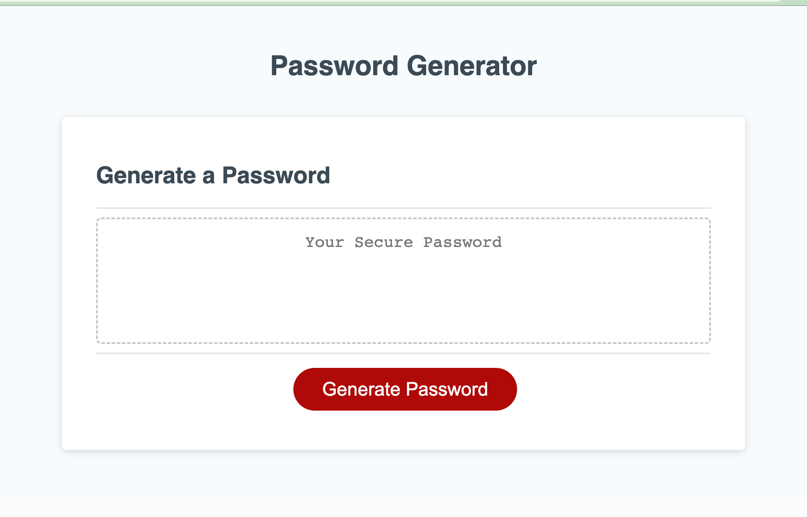
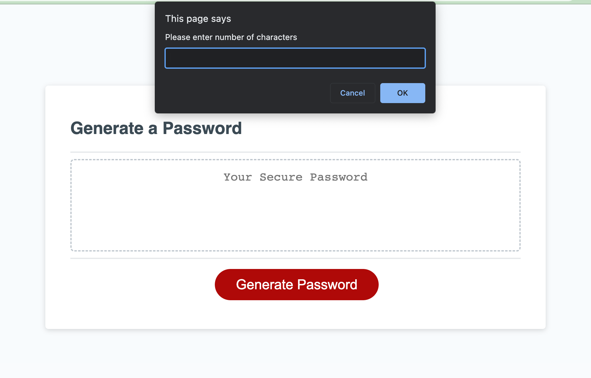
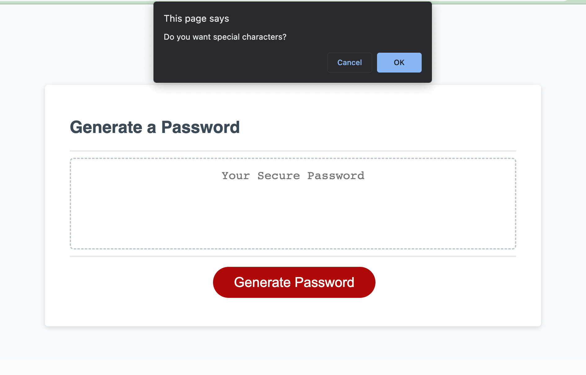
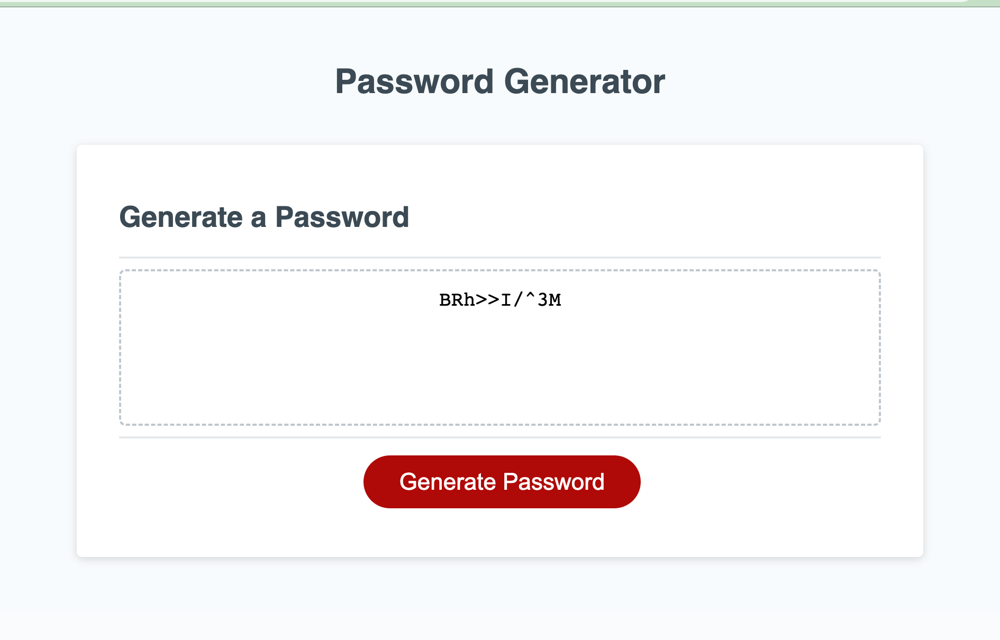
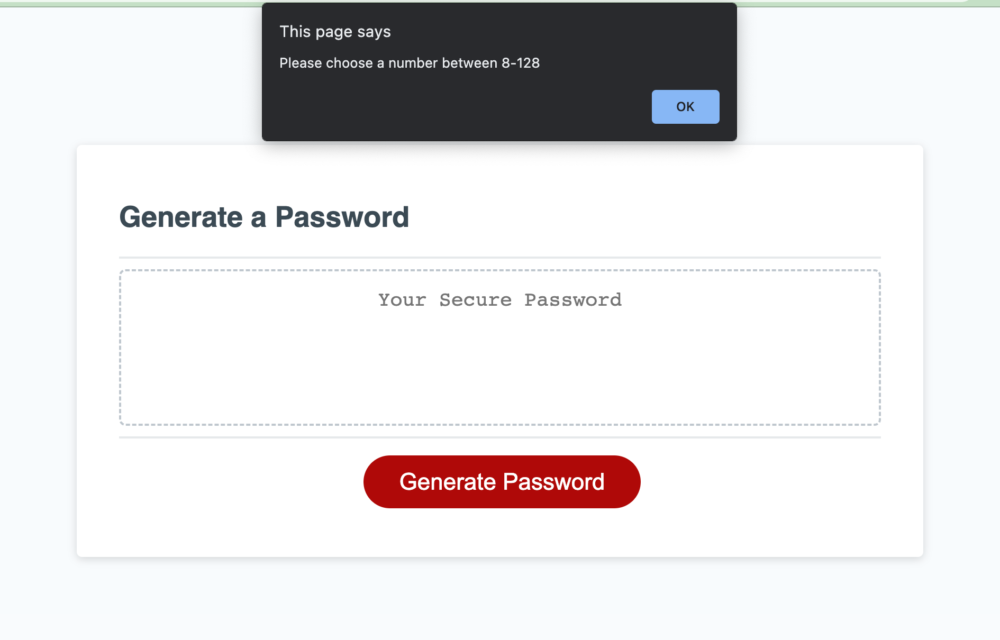

# password-generator

## Description

This is a web application that provides the user with a randomly generated password that meets their desired criteria while solving the problem of having to create a password that provides strong security to your private and important information. The goal was to create an application that could generate a random password equivalent to the number the user inputs. The password must meet 1 of 4 character criteria; must includee either uppercase letters, lowercase letters, numbers, or special characters. In this project, I am aiming to apply my newly acquired knowledge of javascript functions, conditional statements, for loops, methods, and manipulating the DOM. 

## Table of Contents

- [Installation](#installation)
- [Usage](#usage)
- [Acknowledgments](#acknowledgments)
- [License](#license)

## Installation

View the [live site](https://silkyjazz.github.io/password-generator/`) on GitHub.

## Usage

The page is loaded with a button and a UI to display the newly generated password.

Once the user clicks on the button they are prompted the enter in a number. The number must be longer than 8 characters in length but no more than 128 characters.

When the user enters a number between 8-128 the fun begins! They will then see a confirm box with the question 'Do you need Uppercase?' The user has the option to choose between uppercase, lowercase, numbers, and special characters. They can choose a random mixture of all four or just one criteria by itself (all symbols, all numbers, etc.) but the requirement is that they must choose at lease one category. 

After the user clicks through the criteria the password is generated and displayed on the UI.

If the wish to include just one criteria the output will be

The user will see this screen if the number they have entered does not meet the minimum of 8 or maximum of 128.

## Acknowledgments

This is a list of resources I used while building out this project. I looked to these documents when I encountered questions I did not have answers to. 

-[Generate A Random Number](https://stackoverflow.com/questions/1527803/generating-random-whole-numbers-in-javascript-in-a-specific-range)
-[For Loop](https://developer.mozilla.org/en-US/docs/Web/JavaScript/Guide/Loops_and_iteration)
-[Making Decisions In Your Code](https://developer.mozilla.org/en-US/docs/Learn/JavaScript/Building_blocks/conditionals)
-[Parse Int](https://developer.mozilla.org/en-US/docs/Web/JavaScript/Reference/Global_Objects/parseInt)

## License

MIT License

Copyright (c) 2021 Othneil Drew

Permission is hereby granted, free of charge, to any person obtaining a copy
of this software and associated documentation files (the "Software"), to deal
in the Software without restriction, including without limitation the rights
to use, copy, modify, merge, publish, distribute, sublicense, and/or sell
copies of the Software, and to permit persons to whom the Software is
furnished to do so, subject to the following conditions:

The above copyright notice and this permission notice shall be included in all
copies or substantial portions of the Software.

THE SOFTWARE IS PROVIDED "AS IS", WITHOUT WARRANTY OF ANY KIND, EXPRESS OR
IMPLIED, INCLUDING BUT NOT LIMITED TO THE WARRANTIES OF MERCHANTABILITY,
FITNESS FOR A PARTICULAR PURPOSE AND NONINFRINGEMENT. IN NO EVENT SHALL THE
AUTHORS OR COPYRIGHT HOLDERS BE LIABLE FOR ANY CLAIM, DAMAGES OR OTHER
LIABILITY, WHETHER IN AN ACTION OF CONTRACT, TORT OR OTHERWISE, ARISING FROM,
OUT OF OR IN CONNECTION WITH THE SOFTWARE OR THE USE OR OTHER DEALINGS IN THE
SOFTWARE.

## Badges

![Javascript] (https://img.shields.io/badge/JavaScript-323330?style=for-the-badge&logo=javascript&logoColor=F7DF1E)

## Contact Me

I'd love to stay connected [https://www.linkedin.com/in/jasmine-ulloa-819748248/]! You can reach me via email at Ulloajazz6@gmail.com

